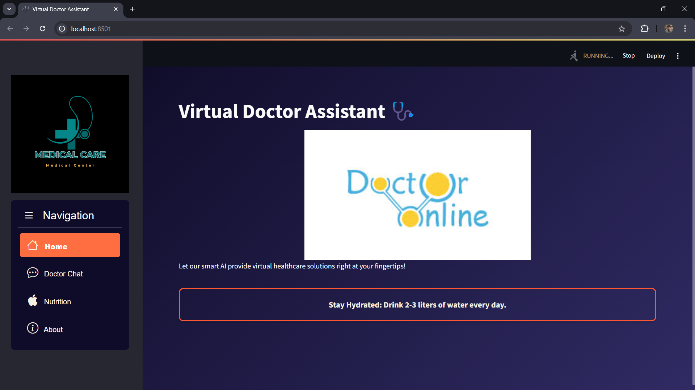
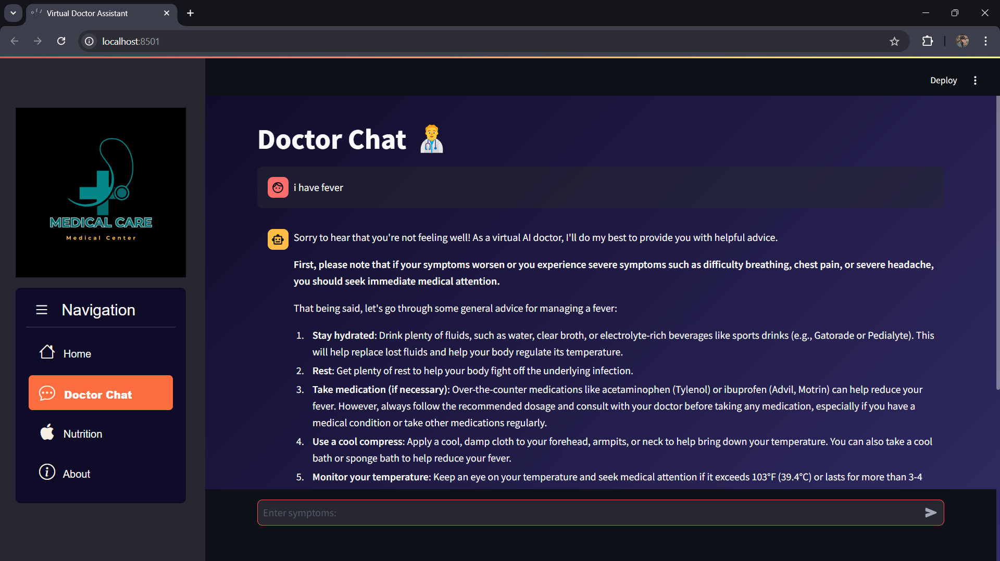
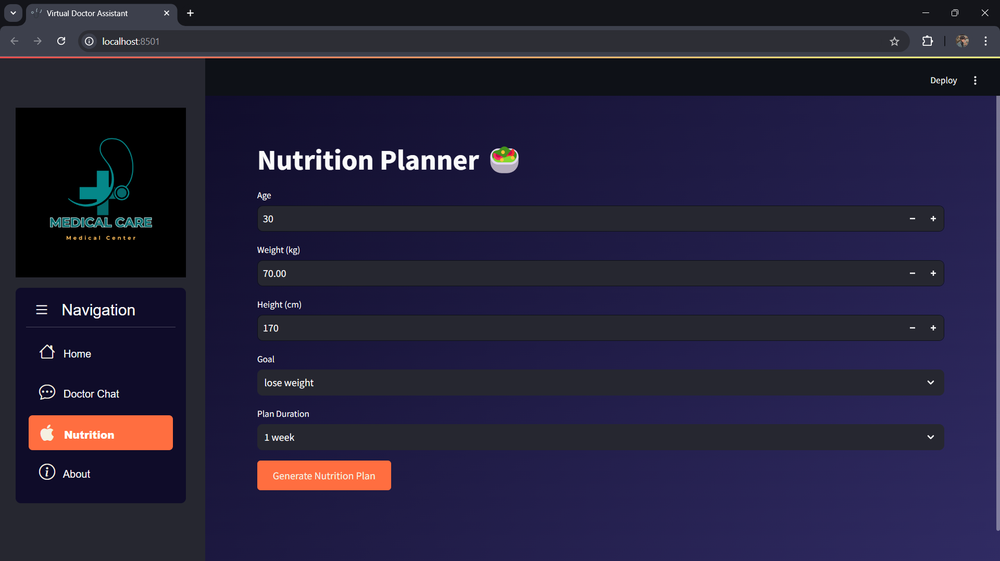

# Virtual Doctor Assistant 🩺

## Overview
Virtual Doctor Assistant is a virtual doctor platform powered by AI to assist users in monitoring their health and well-being. This application provides an interactive platform for doctor consultations, personalized nutrition plans, and general health tips.

## Features 🌟
- **Home Page:** Overview of Virtual Doctor Assistant with health tips and motivational animations.
- **Doctor Chat:** AI-powered virtual doctor to assist users based on their symptoms.
- **Nutrition Planner:** Generate personalized nutrition and exercise plans based on user input.
- **About Us:** Information about the development team.

## Tech Stack 💻
- **Frontend:** Streamlit, CSS for styling
- **Backend:** Groq API for AI responses, Python for logic implementation
- **PDF Reports:** FPDF for generating downloadable nutrition reports

## Installation 🛠️

1. Clone the repository:
   ```bash
   https://github.com/AyanSrivastava11/virtual-doctor-assistant
   ```

2. Navigate to the project directory:
   ```bash
   cd virtual doctor assistant
   ```

3. Install the required dependencies:
   ```bash
   pip install -r requirements.txt
   ```

4. Run the Streamlit app:
   ```bash
   streamlit run app.py
   ```

## Usage

### Navigation Menu
- **Home:** Introduction to the platform and health tips.
- **Doctor Chat:** Interactive chat for medical advice.
- **Nutrition:** Generate custom nutrition plans based on your goals.
- **About:** Learn more about the development team.

### Generating a Nutrition Plan
1. Enter age, weight, height, and goal.
2. Choose the plan duration.
3. Click the "Generate Nutrition Plan" button.
4. Optionally generate and download a PDF report.

## API Configuration
To use the Groq API for AI responses:
1. Obtain an API key from Groq.
2. Add your API key to the Streamlit secrets file (`.streamlit/secrets.toml`):
   ```toml
   [groq_api]
   groq_api_key = "your_groq_api_key_here"
   ```

## Screenshots 📸




## Contributing 🤝
We welcome contributions! To contribute:
1. Fork the repository.
2. Create a new branch (`git checkout -b feature/YourFeatureName`).
3. Commit your changes (`git commit -m 'Add some feature'`).
4. Push to the branch (`git push origin feature/YourFeatureName`).
5. Open a pull request.

## License 📜
This project is licensed under the MIT License.

## Acknowledgements 🙏
- Groq API for powering AI interactions.
- Streamlit for providing an easy-to-use framework for building interactive apps.

## Contact 📧
For any inquiries or issues, please contact:
- **Ayan Srivastava:** [LinkedIn](https://www.linkedin.com/in/ayan-srivastava11/)

